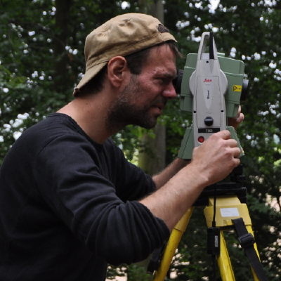
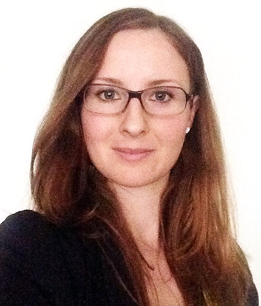

```{r, echo = FALSE}
# https://stackoverflow.com/questions/25646333/code-chunk-font-size-in-rmarkdown-with-knitr-and-latex
def.chunk.hook  <- knitr::knit_hooks$get("chunk")
knitr::knit_hooks$set(chunk = function(x, options) {
  x <- def.chunk.hook(x, options)
  ifelse(options$size != "normalsize", paste0("\\", options$size,"\n\n", x, "\n\n \\normalsize"), x)
})
```

# Motivation

## Vessel shape and typology

## Available Approaches

# Shape Extraction

## 'by hand'

## Adaptive Contour

# Shape Analysis

## PCA & hclust

## t-sne & hdbscan

# Case studies

## Bell Beakers of the Iberian Peninsula

## Neolithic Swiss Ceramic

## Thank you
{ width=33px }
**Martin Hinz**              
martin.hinz@ufg.uni-kiel.de

{ width=33px }
**Caroline Heitz**                   
caroline.heitz@iaw.unibe.ch  

